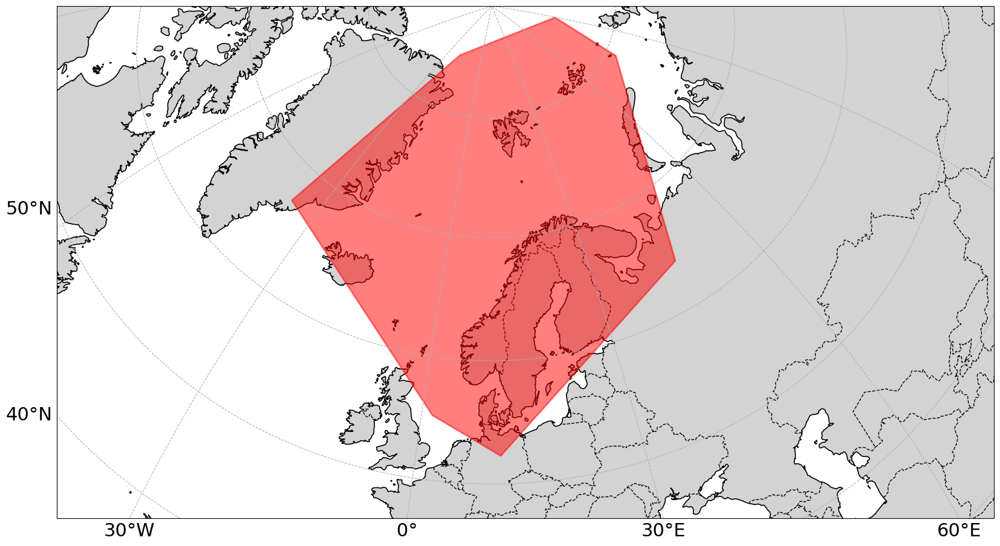

# Introducing satellittdata.no

[satellittdata.no](https://satellittdata.no) is a platform provided by the Norwegian National Ground Segment for Satellite Data. It hosts a catalogue of **Level 0 to Level 2 (L0–L2) data** (LINK TO LEVELS PAGE) dating back to the launch date of each Sentinel missions. Data are provided for a region covering **Norway, the Norwegian Sea, Svalbard, the Greenland Sea, and much of the Barents Sea**.



## Why use [satellittdata.no](https://satellittdata.no)?

[satellittdata.no](https://satellittdata.no) offers a range of advantages over other platforms that serve Sentinel data (e.g. CDSE):

- **High bandwidth**
  Users benefit from increased bandwidth compared to other platforms. There is currently no limit on the number of products that can be downloaded in parallel.

- **Easy visualisation of data on a map**
  Data can be easily overlain on a map using the **Web Map Service (WMS)**. Users can easily navigate around the map and zoom in on their region of interest.

  WMS can be integrated into your own services, as opposed to the CDSE viewer. SEPARATE MORE EXTENSIVE TUTORIAL ABOUT WMS.

  # TODO: INCLUDE IMAGE

- **Comprehensive data availability**
  All Sentinel missions are provided in their native Copernicus formats:
  - **Sentinel-1:** (SAFE)
  - **Sentinel-2:** (SAFE)
  - **Sentinel-3:** (SEN3)
  - **Sentinel-5P:** (netCDF)

  In addition, satellittdata.no maintains a rolling archive in **CF-NetCDF** format:
  - **365 days** of Sentinel-2 data
  - **30 days** of Sentinel-1 GRD data
  LINK TO NORDATANET NETCDF TUTORIAL OR PLATFORM SPECIFIC TUTORIALS?

  Sentinel-2 data are also available in [datacubes](), a visualisation-ready product that combines products over a long time period for a single tile. Data are available for 1 year for every tile across the area we serve LINK, and can be generated on request for historic data.
  TUTORIAL ABOUT DATACUBES IN NBS

  It will soon also be possible to access the same data in **GeoTIFF** format.

- **Flexible CF-NetCDF access**
  CF-NetCDF is a widely used, machine-readable standard for geospatial data. On satellittdata.no these files are served via **OPeNDAP**, which enables:
  - Direct data streaming without downloading full products
  - Server-side subsetting and reduction
  - On-demand, flexible access

  This lowers the barrier for users who are less familiar with the SAFE format and makes working with Sentinel data more efficient.

> 💡 CF-NetCDF files for older products can also be generated upon request.

## Search interfaces

[satellittdata.no](https://satellittdata.no) offers both graphical user interfaces - a [simple]() and an [advanced]() search interface - and machine interfaces.

### Graphical user interfaces

VIDEO ABOUT GRAPHICAL USER INTERFACES

#### Simple search
IMAGE OF SIMPLE SEARCH

The simple search allows the user to search based on the time the product was created, coordinates (using a bounding box on a map), or using a free text search. EXPLAIN FREE TEXT SEARCH A BIT.

#### Advanced search

IMAGE OF ADVANCED SEARCH.

In addition to all the features of the simple search, the advanced search allows users to filter based on a number of important parameters

* Mission
* Product type (link to vocab?)
* Cloud cover (Sentinel-2 products only)
* ...

#### Machine interfaces

[satellittdata.no](https://satellittdata.no) is queryable using the following machine interfaces:
* Catalogue Web Service (CSW)
* THREDDS (abbreviation)
* ...

LINK TO TUTORIALS ON EACH OF THESE.

```{tableofcontents}
```